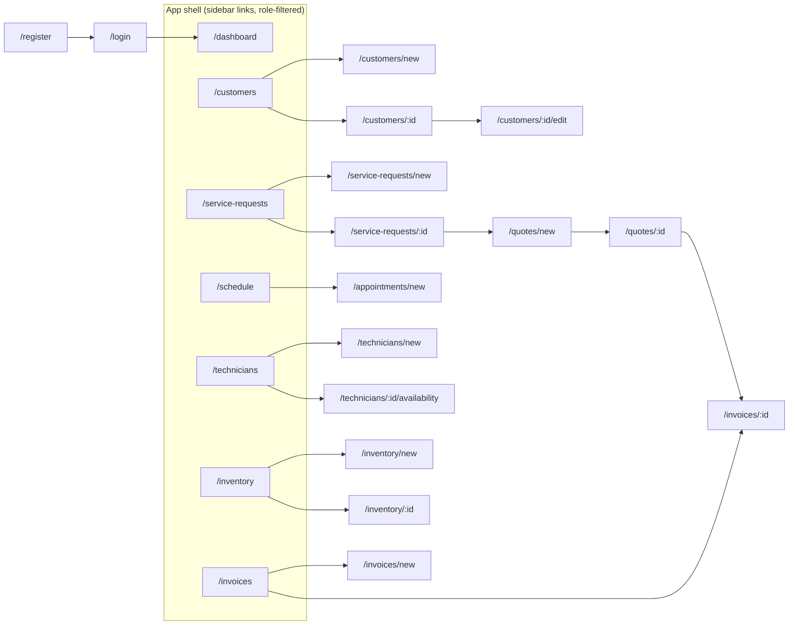
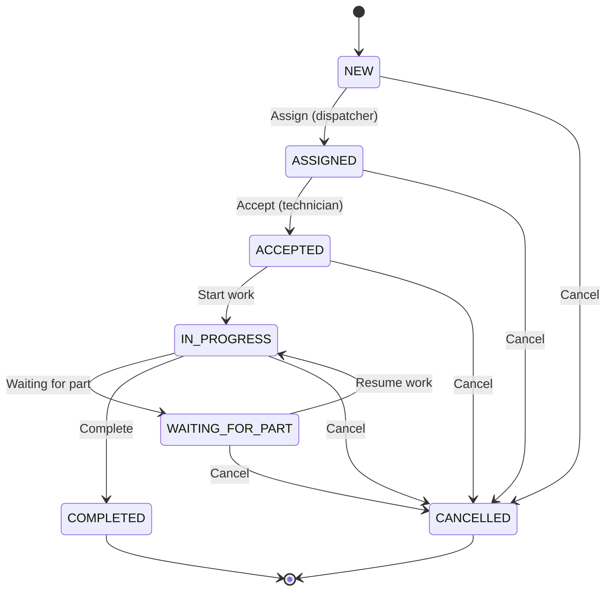
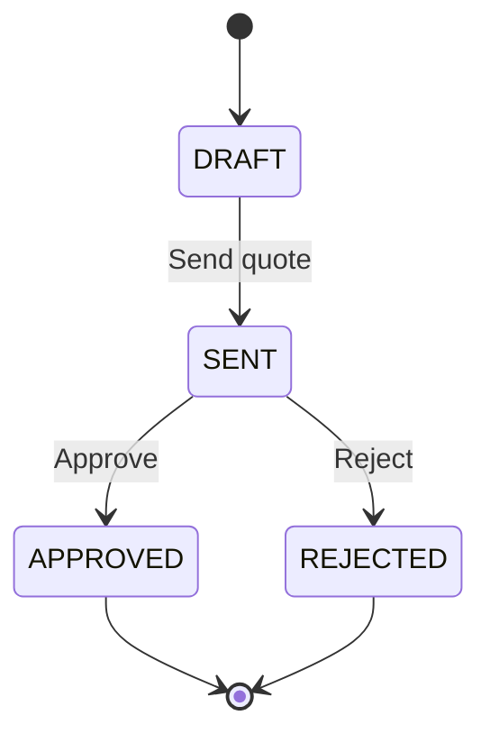
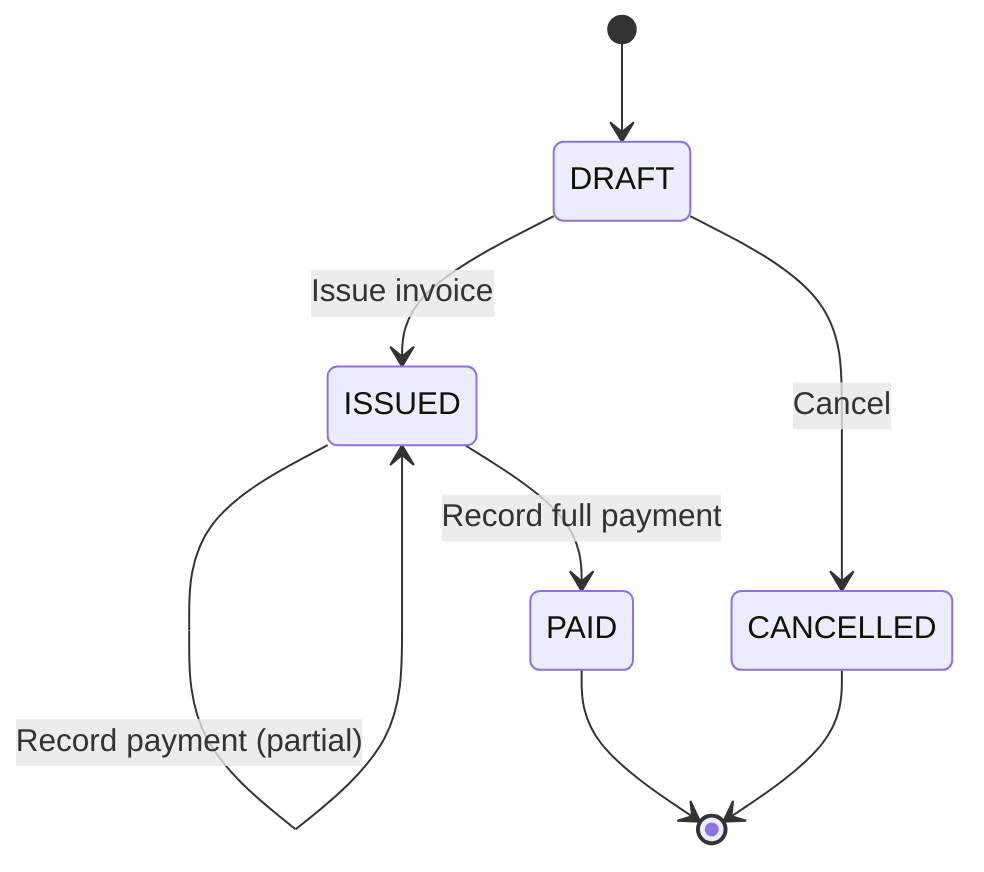
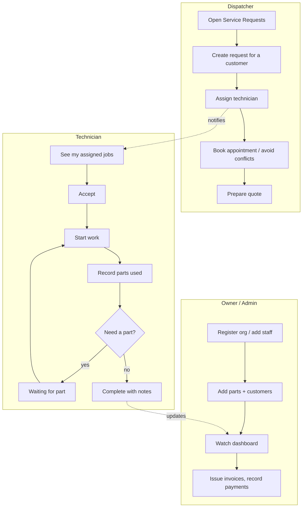

# Fixonaut — End-User App Guide (screen-by-screen)

How a real user actually uses the app: every screen, every feature, and what it's for.
Verified against `app/router.tsx`, `layouts/AppLayout.tsx`, and each page component.

The whole app lives inside one dark, orange-accented shell: a top bar (brand +
notification bell + user avatar + logout) and a left sidebar whose links change by role.

---

## 0. Navigation map (what's reachable)

**Sidebar links and who sees them** (from `AppLayout.tsx`):

| Link | OWNER | ADMIN | DISPATCHER | TECHNICIAN |
|---|:--:|:--:|:--:|:--:|
| Dashboard | ✔ | ✔ | ✔ | ✔ |
| Customers | ✔ | ✔ | ✔ | |
| Service Requests | ✔ | ✔ | ✔ | ✔ |
| Schedule | ✔ | ✔ | ✔ | ✔ |
| Technicians | ✔ | ✔ | ✔ | ✔ |
| Inventory | ✔ | ✔ | ✔ | |
| Invoices | ✔ | ✔ | ✔ | |

> Technicians don't see the **Inventory** link, but they still record parts used from
> inside a job (the "Parts used" card on the service-request detail page).

---

## 1. Getting in

### Register an organization — `/register`
The first user signs their business up. Fields: **Organization name**, **Organization
slug**, **Full name**, **Email**, **Password** (≥ 8 chars). This creates the org and the
first **OWNER** account, then redirects to `/login`.

### Log in — `/login`
Email + password. On success the app lands on the **Dashboard**. Sessions survive page
refresh (silent token refresh); after 15 min of an expired token the app refreshes
invisibly, and only a truly dead session bounces you to login with "session expired".

### The shell (always visible once in)
- **Notification bell** — live count, updates over WebSocket the instant something
  relevant to you changes (e.g. a job assigned to you).
- **User avatar + name/email**, and **Logout** (revokes the session and disconnects the socket).

---

## 2. Dashboard — `/dashboard` (everyone)

The operational home screen. Four **live metric cards**:

| Card | What it tells you |
|---|---|
| **Open Requests** | active operational workload |
| **Assigned Today** | requests scheduled for today |
| **Completed This Week** | throughput |
| **Pending Payments** | outstanding invoice balance (₹) |

Below: a **status-distribution chart** (jobs grouped by status) and a **Recent service
activity** feed (latest status changes, who made them, when — badged "Live").

---

## 3. Customers — `/customers` (Owner / Admin / Dispatcher)

- **List**: searchable, paginated table of customers.
- **+ New customer** → `/customers/new`: name, phone, email, address.
- **Customer detail** → `/customers/:id`: contact info, their **assets/equipment**
  (model, serial, warranty), and service history.
- **Edit** → `/customers/:id/edit`.

Use: the address book of *who* needs service and *what equipment* they own.

---

## 4. Service Requests — the core of the app

### List — `/service-requests` (all staff roles)
- **Search** by title/description (debounced).
- **Filter** by status (New … Cancelled) and by priority (Low/Normal/High/Urgent).
- **Paginated** table (desktop) / cards (mobile); each row links to the detail page and
  shows customer, priority, status, assigned technician, scheduled time.
- **+ New request**.

### Create — `/service-requests/new` (Owner / Admin / Dispatcher)
Title, description, **customer** (dropdown), **priority**, **scheduled date & time**.
Saved as status **NEW**.

### Detail — `/service-requests/:id` (the command center)
This one screen adapts to your role and the request's current status:

- **Request details** card: customer, scheduled time, assigned technician, description.
- **Assign technician** panel *(Owner/Admin/Dispatcher, and only while status = NEW)*:
  pick a technician → status becomes **ASSIGNED** and that tech is notified.
- **Workflow actions** *(Owner/Admin/Technician; a technician can only act on their own
  assigned job)* — buttons appear based on status:

  | Current status | Button(s) shown |
  |---|---|
  | ASSIGNED | **Accept request** |
  | ACCEPTED | **Start work** |
  | IN_PROGRESS | **Waiting for part**, **Complete request** |
  | WAITING_FOR_PART | **Resume work** |
  | any non-final | **Cancel request** (with confirm) |
  | COMPLETED / CANCELLED | no actions — "No further actions" |

- **Create quote** link → starts a quote pre-linked to this job.
- **Parts used** card: record spare parts consumed (part dropdown showing live stock,
  quantity, unit cost, note). Stock is checked server-side — you can't over-consume, and
  it's blocked once the job is completed/cancelled. Shows a running list + line totals.
- **Status timeline**: the full audit trail (from → to, note, who, when).

---

## 5. Technicians — `/technicians`

- **List** of the org's technicians (name, service area).
- **+ New technician** → `/technicians/new` *(Owner/Admin)*: creates the technician user.
- **Availability** → `/technicians/:id/availability`: define working windows
  (start/end time) so scheduling knows when they're bookable.

---

## 6. Schedule — `/schedule`

- View **appointments**.
- **+ New appointment** → `/appointments/new`: book a technician for a time window. The
  backend **rejects overlaps** — you can't double-book a technician (conflict error).

---

## 7. Inventory — `/inventory` (Owner / Admin / Dispatcher)

- **Parts list**: search by SKU or name; each part shows quantity on hand and a
  **Low stock** badge when at/below its reorder level.
- **+ New part** → `/inventory/new` *(Owner/Admin)*: name, SKU, unit, quantity, reorder level.
- **Part detail** → `/inventory/:id`: current stock, reorder level, and a **Restock**
  form (quantity, unit cost, note) that adds stock and records a stock transaction.

Use: keeps parts accurate so technicians can only consume what actually exists.

---

## 8. Quotes & Invoices — billing (Owner / Admin / Dispatcher)

### Quote — created from a job, then `/quotes/:id`
Line items (labor + parts) with **subtotal, discount, tax, total** computed on the
backend. Lifecycle via buttons:

### Invoice — `/invoices` list, `/invoices/:id` detail
Totals: subtotal, discount, tax, total, amount paid, remaining. Lifecycle:

**Record payment** takes an amount and tracks remaining balance until the invoice is
fully **PAID**. Pending balances roll up into the Dashboard's "Pending Payments" card.

---

## 9. A day in the life (per role)

- **Owner** — sets everything up, can do any action, lives on the dashboard and billing.
- **Dispatcher** — the front desk: creates customers/requests, assigns techs, schedules,
  prepares quotes/invoices. Cannot work a job.
- **Technician** — sees and progresses **only their own** jobs: accept → start →
  (wait for part) → complete, logging parts safely along the way.
- **Customer** — today a managed record (contact, assets, history). The self-service
  portal (create own request, approve quote online) is designed but **not built yet**.

---

## 10. Feature → use cheat sheet

| Feature | Where | Use |
|---|---|---|
| Register / Login / silent refresh | `/register`, `/login` | secure access, stay signed in |
| Notification bell | top bar | real-time alerts (assignment, status change) |
| Dashboard metrics + charts | `/dashboard` | daily operational picture |
| Customers + assets | `/customers` | who needs service, what equipment |
| Service request lifecycle | `/service-requests/:id` | run a job end to end |
| Assign technician | request detail | give the job an owner (conflict-checked) |
| Parts used | request detail | record materials, protect stock |
| Status timeline | request detail | trustworthy audit history |
| Technicians + availability | `/technicians` | staff and their bookable hours |
| Schedule / appointments | `/schedule` | book techs without double-booking |
| Inventory + restock | `/inventory` | accurate, non-negative stock |
| Quotes | `/quotes/:id` | estimate → send → approve |
| Invoices + payments | `/invoices/:id` | bill and track what's owed |
