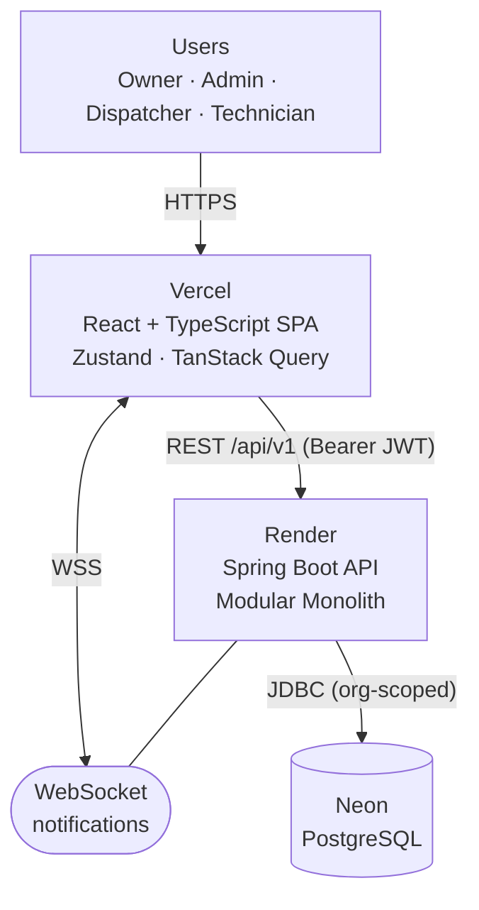
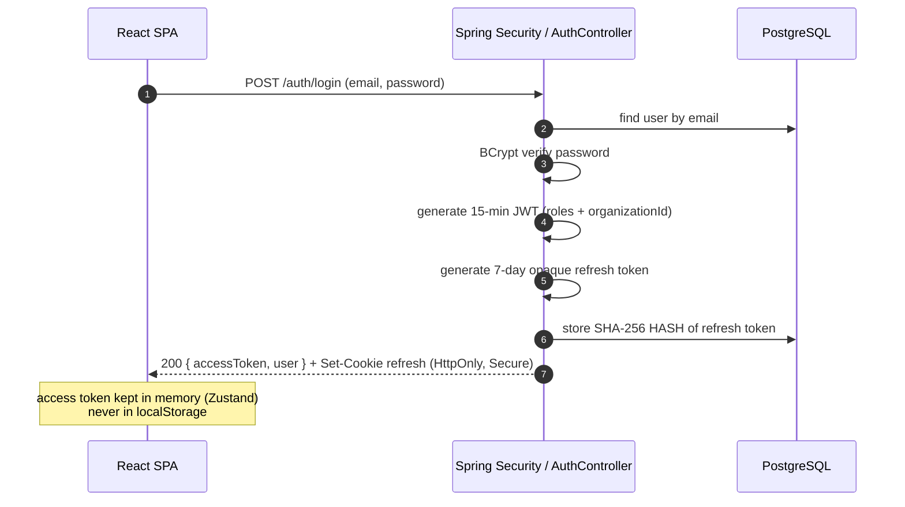
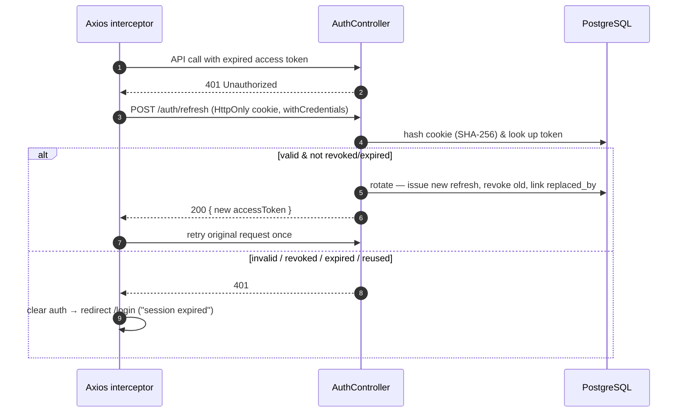
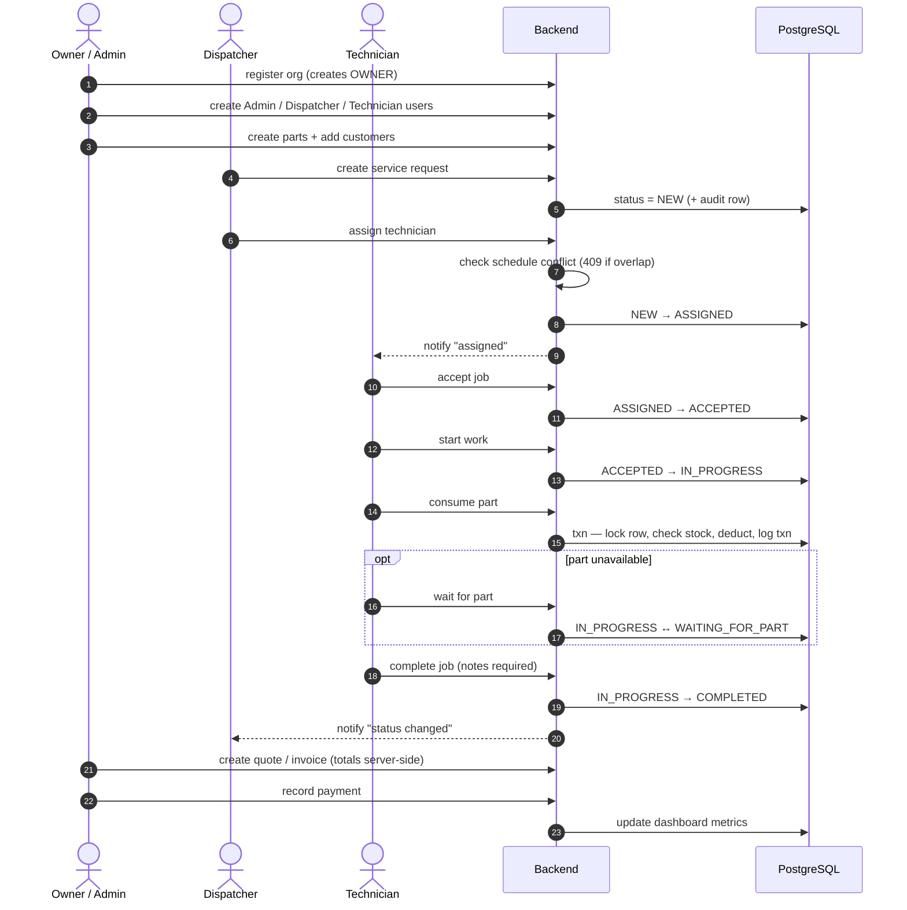
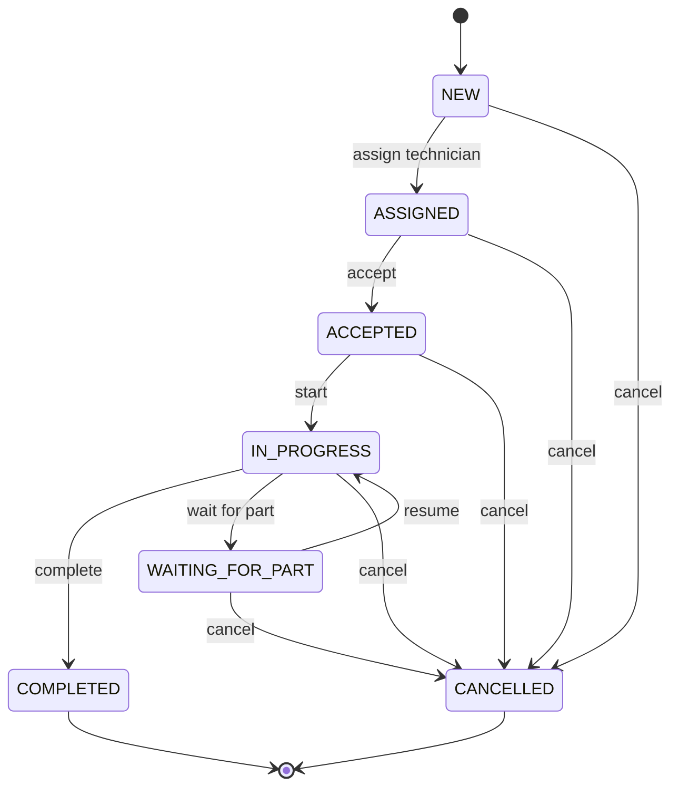
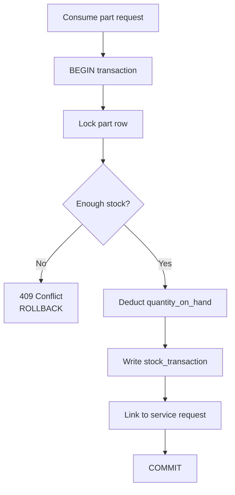
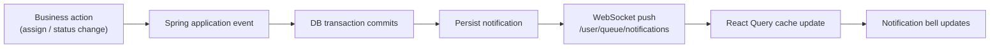

# Fixonaut — Working Flow & User Roles

This document describes the **end-to-end working flow** of Fixonaut and how it differs
per **user role**. All diagrams are Mermaid and render automatically on GitHub.

> Verified against source: `UserRole.java`, all `*Controller.java` (`@PreAuthorize`),
> `ServiceRequestEntity.canTransitionTo()`, `ServiceRequestService`, and
> `docs/auth-refresh-token-flow.md`.

---

## 1. User roles

| Role | Purpose | Status in code |
|------|---------|----------------|
| **OWNER** | Registers the org, super-user, sees reports | ✅ fully wired |
| **ADMIN** | Manages users, technicians, parts, billing | ✅ fully wired |
| **DISPATCHER** | Reviews requests, assigns techs, schedules | ✅ fully wired |
| **TECHNICIAN** | Works **only their own** assigned jobs | ✅ fully wired |
| **CUSTOMER** | Designed for self-service portal | ⚠️ **enum only — no endpoints yet** |

> **Note:** The `CUSTOMER` role exists in `UserRole` but is granted access by **no**
> controller. The customer self-service portal is explicitly deferred
> ("Do not implement yet" in `auth-refresh-token-flow.md`). Today a *customer* is a
> **data record** managed by staff, and dispatchers create requests on their behalf.

---

## 2. High-level architecture



---

## 3. Role → capability matrix

`O`=OWNER · `A`=ADMIN · `D`=DISPATCHER · `T`=TECHNICIAN · ✔ = allowed

| Action | O | A | D | T |
|---|:--:|:--:|:--:|:--:|
| Register org / login / refresh / logout | public | public | public | public |
| Manage technicians (create/update/deactivate) | ✔ | ✔ | | |
| Manage parts / inventory (create/update/delete) | ✔ | ✔ | | |
| Create / update / delete customers | ✔ | ✔ | ✔ | |
| Create service request | ✔ | ✔ | ✔ | |
| Assign technician | ✔ | ✔ | ✔ | |
| Schedule appointment | ✔ | ✔ | ✔ | |
| Accept / Start / Wait-for-part / Complete job | ✔ | ✔ | | ✔ |
| Cancel request | ✔ | ✔ | ✔ | ✔ |
| Consume parts on a job | ✔ | ✔ | | ✔ |
| Quotes / invoices / payments | ✔ | ✔ | ✔ | |
| View dashboard metrics | ✔ | ✔ | ✔ | |
| List / view requests + history | ✔ | ✔ | ✔ | ✔ |
| Notifications | any authenticated user | | | |

**Extra guard on technicians** (`ServiceRequestService.validateTransitionActor`): a
technician may only act on a request where they are the **assigned** technician, else
`403 Forbidden`. Owners/Admins bypass this.

---

## 4. Authentication flow (login)



## 4b. Silent refresh (access token expires after 15 min)



---

## 5. End-to-end service lifecycle (per role)



---

## 6. Service-request state machine



Rules enforced in `ServiceRequestEntity`:

- `NEW → ASSIGNED` **only** via `assignTechnician` (fails if not `NEW`).
- `COMPLETED` and `CANCELLED` are **terminal**.
- Cancel is allowed from any non-terminal state.
- Any invalid transition → `IllegalStateException` → **HTTP 409 Conflict**.
- Every valid transition writes a **status-history audit row** (actor, from, to, note, time).

---

## 7. Inventory consistency (technician consumes a part)



Guarantees `quantity_on_hand` can never go negative, even under concurrent deductions.

---

## 8. Real-time notifications



Fires when a technician is assigned (`SERVICE_REQUEST_ASSIGNED`) or when someone other
than the assigned technician changes a job's status.

---

## 9. Multi-tenancy (data isolation)

`organization_id` is read from the **signed JWT**, never from the request body. Every
query is scoped:

```sql
WHERE organization_id = :currentOrganizationId
```

No role can see or mutate another organization's data.

---

## 10. Role summary

- **Owner** — bootstraps the org, can do everything, sees reports.
- **Admin** — manages techs, parts, customers, billing; full operational control.
- **Dispatcher** — front desk: creates customers + requests, assigns techs, schedules,
  bills, watches the dashboard — but cannot work a job.
- **Technician** — works **only their own** assigned jobs: accept → start →
  (wait for part) → complete, consuming parts safely.
- **Customer** — currently a managed record (contact + assets + history), not a login;
  the self-service portal is designed but not built yet.
